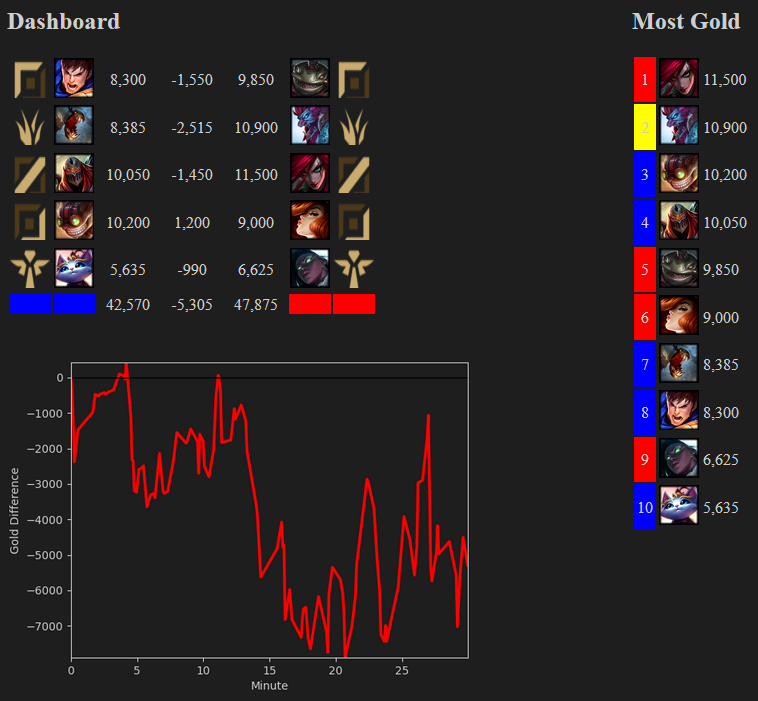

#League Dashboard

Greetings summoner!

This is a dashboard for League of Legends.
It will show you helpful statistics for your running game (see screenshot for more info).
The dasboard will create a webserver. Therefore, you need to open it in your browser (default: https://127.0.0.1:5000/) on your seconds monitor.
If you don't have a second monitor, you can also open it with every device connected to the same local area network e.g. your smartphone.
And everything's in dark mode, of course.

## Usage
On Windows:
> Run LeagueDashboard.bat

On Linux:
> python app.py

Open up the shown link in your browser.