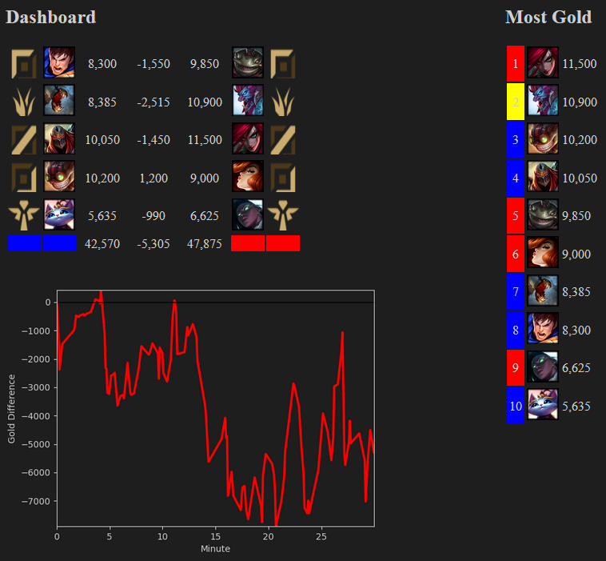

# League Dashboard

Greetings summoner!

This is a dashboard for League of Legends.
It will show you helpful statistics for your running game.
And everything's in dark mode, of course.

## How is the gold difference calculated?
The dashboard will update the gold values of your team instantly.
Your enemies gold will only be updated when they are seen on the map.
Therefore, there is a 2,5k gold difference between teams on each start (well, until you saw all enemy champions).

## How it works
This is no overlay.
The dasboard will create a webserver.
Therefore, you can view it in your browser (default: https://127.0.0.1:5000/) while playing on your second monitor for example.
If you don't have a second monitor, you can also open it with every device connected to the same local area network e.g. your smartphone.
The tool will provide you the url.

But why no overlay? There are already some tools which provide similar functionality as overlay, but they all crash. At least in my case. As most people own a second monitor / another device (smartphone) I decided to put it in the browser.

## Usage
On Windows:
> Run LeagueDashboard.bat

*If you want a desktop shortcut, do not just move the batch to desktop instead create a shortcut to it.*

On Linux:
> python app.py

Open up the shown link in your browser.
